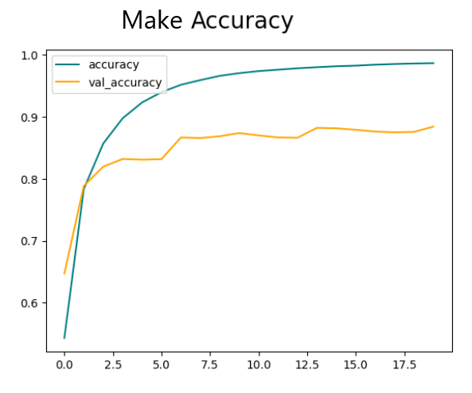
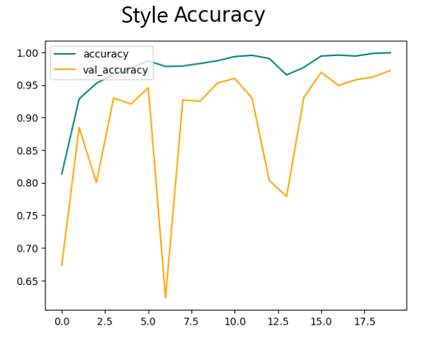
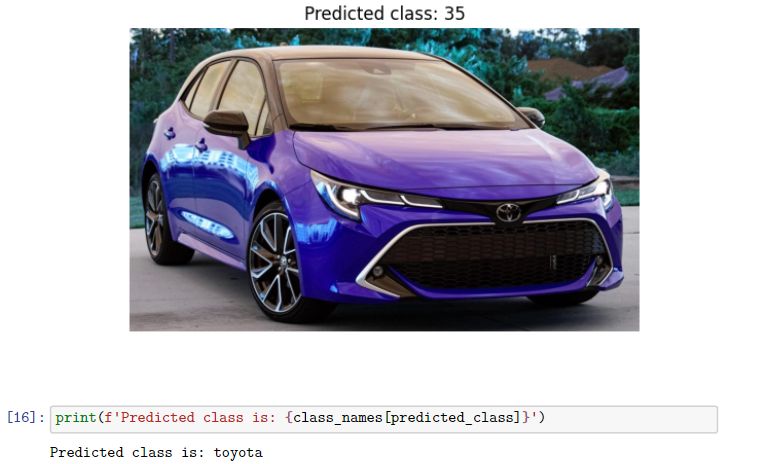
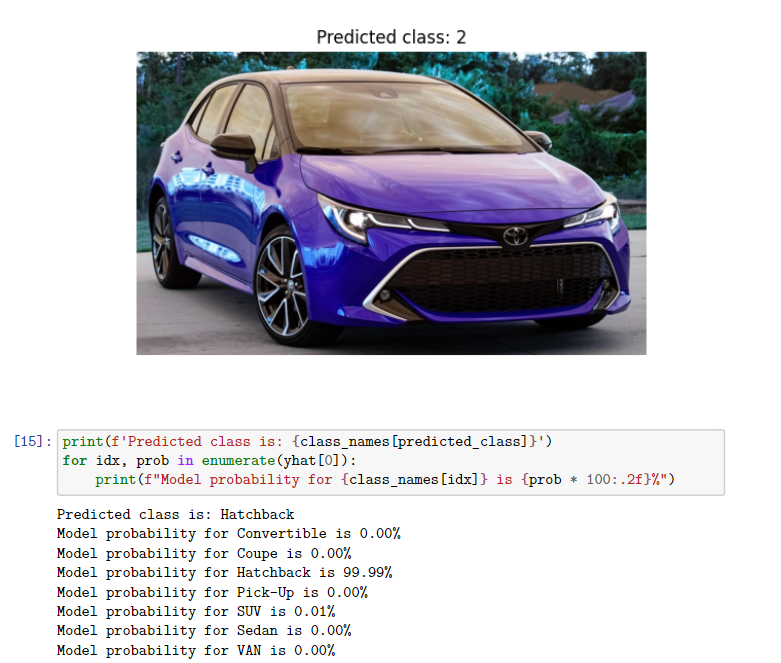

# Car-Classyfier: A Deep Learning Approach to Car Make, Model, and Style Prediction

Car-Classyfier is an application designed to predict the make, model, and style of cars from uploaded images. The backend API leverages machine learning models trained on a variety of car image datasets, while the frontend provides a user-friendly interface for uploading images and displaying predictions.

## Table of Contents
1. [Training](#train)
2. [Backend](#backend)
3. [Frontend](#frontend)

## Features:
- Upload images via file selection or drag-and-drop interface.
- Predict car make, model, and style from the uploaded image.
- Interactive and responsive UI built with React.
- Backend API developed using FastAPI with trained TensorFlow/Keras models.

Project Structure
```python
├── CarBackEnd/
│   ├── app.py                    # API call code for making prediction
│   ├── mappings/                 # JSON mappings for predictions (int -> name)
│   ├── models/                   # Pre-trained car-related ML models
│   └── requirements.txt          # Python library requirements for backend
├── CarFrontEnd/
│   ├── car-prediction-app
│   │   ├── src
│   │   │   ├── App.js            # React-based frontend code
│   │   │   └── App.CSS           # Styles for the frontend    
├── CarBrandMakes.ipynb           # Trains a model on a car's make
├── CarStyle.ipynb                # Trains a model on a car's style
└── CarBrandModels.py             # Trains multiple models to predict a car's model
```

## Training The Convolutional Nueral Networks <a name="train"></a>

### What are Convolutional Neural Networks (CNNs)?

Convolutional Neural Networks (CNNs) are a class of deep learning models specifically designed for analyzing visual data, such as images. Unlike traditional fully connected neural networks, CNNs excel in extracting hierarchical features from images through convolutional layers, pooling layers, and fully connected layers.

#### CNNs are particularly powerful in tasks like:

- Image Classification: Categorizing an image into one of several predefined classes.
- Object Detection: Identifying specific objects within an image.
- Image Segmentation: Dividing an image into segments that correspond to different objects or parts.

CNNs are composed of layers that learn different aspects of visual information, from simple features (e.g., edges or textures) in early layers to more complex patterns (e.g., shapes, objects) in deeper layers.

### The Training Process

For this project, I trained CNNs to recognize and predict car makes, models, and styles from images. To ensure robust predictions, a large and diverse dataset is crucial. In this project, I used the `VMMRdb` dataset, a comprehensive collection of car images containing over **280,000 images** which was stored as **11 GB** of data.

The first step to make this project work was to parse the data. The `VMMRdb` dataset has images split into over 9000 classes of `make_model_year` for example, `acura_cl_1997` which is not very useful for my purpose. What I did to remedy this was make three different datasets. One for the just the car make e.g. `honda` or `bmw`. Then I split each make into even more sub directories containing the model of each make e.g. `honda -> accord, civic, ect`. The style was my own data set acheived by downloading images from google as I was not able to find a good existing dataset.

Now that the data was ready they provided a wide range of real-world variability, which is necessary for training high-performance models. This large dataset allowed me to effectively train CNN models for image classification and achieve high accuracy in real-world applications.
Cross-Analysis for Model Selection

To identify the best base CNN architectures, I experimented with a variety of well-known deep learning models, including popular pre-trained architectures. The base CNN models tested in this project include:

```
DenseNet (121, 169, 201)
EfficientNet (B0, B7)
EfficientNetV2 (B0, B3, L, S)
InceptionResNetV2
InceptionV3
MobileNet
MobileNetV2
MobileNetV3Large
ResNet50
ResNet50V2
VGG (16, 19)
```

These base models are chosen for their proven ability to perform well on a wide variety of image recognition tasks. They are pre-trained on large-scale datasets like ImageNet, which provides a strong foundation for transfer learning, making them ideal for fine-tuning on our car image dataset.

### The Experiment

I conducted an extensive cross-analysis of these models, fine-tuning their pre-trained weights on the VMMRdb dataset and custom styles dataset. I trained the models using the following process:

1. Preprocessing the Data: Images were resized, normalized, and augmented to increase diversity in the training set.
2. Training & Fine-Tuning: The models were trained with backpropagation and fine-tuned by adjusting the final layers to fit the car make, model, and style predictions.
3. Cross-Validation: I split the dataset into multiple training and validation sets, testing each model on different splits to ensure a robust evaluation.
4. Evaluating Accuracies: I made sure to understand which base had the best accuracy. I kept the best models when implementing it within the website.


### Results

After training, I evaluated the models on several performance metrics, including accuracy, loss, and recall. Based on the results of my testing, I found that the InceptionResNetV2 model outperformed the other architectures:

```
InceptionResNetV2 achieved:
    88.76% accuracy on Car Make Model Prediction.
    96.63% accuracy on Car Style Prediction.
```
<table align="center">
  <tr>
    <td></td>
    <td></td>
  </tr>
</table>

This model's performance exceeded expectations in both the make and style prediction tasks, providing the highest accuracy while maintaining efficiency. 

The best base model for predicting car models varied and included the following:

```
MobileNet
MobileNetV3Large
InceptionResNetV2
EfficientNetV2B0
EfficientNetV2B3
```

### Summary of the Performance

Google's InceptionResNetV2 proved to be the best performing model for both make and style predictions, demonstrating its ability to learn detailed and abstract features from car images.

<table align="center">
  <tr>
    <td></td>
    <td></td>
  </tr>
</table>

These results demonstrate the power of CNNs and the effectiveness of the VMMRdb dataset in training a highly accurate car prediction system.

## Backend <a name="backend"></a>

The backend of Car-Classyfier is powered by FastAPI, a modern web framework that ensures high performance and quick responses for real-time predictions. It hosts the machine learning models that predict the car make, model, and style. The backend leverages pre-trained TensorFlow/Keras models that were fine-tuned on large datasets. The backend's main functionality includes image preprocessing, loading and using the models, and returning accurate predictions to the frontend through API responses. The backend is optimized to process requests quickly, offering a scalable solution for handling multiple concurrent users.

Tech Stack:

- FastAPI: A fast web framework for building APIs.
- Python: The programming language used for API logic and machine learning integration.
- TensorFlow/Keras: For handling deep learning models and predictions.
- Pillow: For image processing and preparation before feeding it to the models.
- Uvicorn: A fast ASGI server for running the FastAPI application.

### 1. Dependencies

Ensure you have the required libraries installed:

`pip install -r requirements.txt`

### 2. Core Logic
    Model Loading:
    Three TensorFlow/Keras models are loaded:
        A make prediction model.
        A model prediction model.
        A style prediction model.


#### Pipeline:
1. Image is resized and preprocessed.
2. make is predicted using the make model.
3. The corresponding make model's predictions are used to determine the model.
4. Style predictions are inferred using the style prediction model.

```
       +-----------------+
       |   Input Image   |
       +-----------------+
                |
                v
 +-----------------------------+
 |   Predict Car Make Using    |
 |   "Make Prediction Model"   |
 +-----------------------------+
                |
                v
 +-----------------------------+
 |  Get Specific Make's Model  |
 |   Based on Predicted Make   |
 +-----------------------------+
                |
                v
 +-----------------------------+
 |   Predict Car Model Using   |
 |   "Model Prediction Model"  |
 +-----------------------------+  
```

### 3. API Endpoint

```javascript
POST /predict
    Accepts image files (JPEG/PNG).
    Returns a JSON response with predictions:
    {
        "make": "Toyota",
        "model": "Camry",
        "style": "Sedan"
    }
```

Run the Backend:

python app.py

Access the API at: http://127.0.0.1:8000.
## Frontend <a name="frontend"></a>

The Car-Classyfier frontend is a sleek, interactive web application built with React.js, enabling users to easily upload images of cars for classification. It features a drag-and-drop or file selection interface, allowing users to quickly submit images. Once the image is uploaded, the frontend displays the predicted make, model, and style of the car in a user-friendly interface. The frontend communicates seamlessly with the backend through API calls, ensuring fast and accurate predictions. The styling is handled by CSS, with a focus on responsive design to ensure a smooth experience on various devices.

#### Tech Stack:
- React.js: For creating a dynamic, component-based user interface.
- JavaScript/JSX: To handle interactive features and logic.
- CSS: For styling and ensuring a visually appealing, responsive design.
- Axios: For making HTTP requests to the backend API to retrieve predictions.

### 1. Setup

#### Install React and dependencies:

`npm install`

### 2. Features
- Drag-and-drop or select an image file for uploading.
- Previews the uploaded image.
- Displays predictions retrieved from the backend.

#### Run the Frontend:

`npm start`

Access the app at: http://localhost:3000.

## Work in progress <a name="work"></a>
- Hyperparamater tuning
- Using a more robust styles dataset
- Improving the frontend style
- Improving the effeciency of the backend API

Found something wrong in my code or have questions? Feel free to contact me:
- Email: [tanveenbal@gmail.com](tanveenbal@gmail.com)
- LinkedIn: [tanveenbal](https://www.linkedin.com/in/tanveenbal/)
